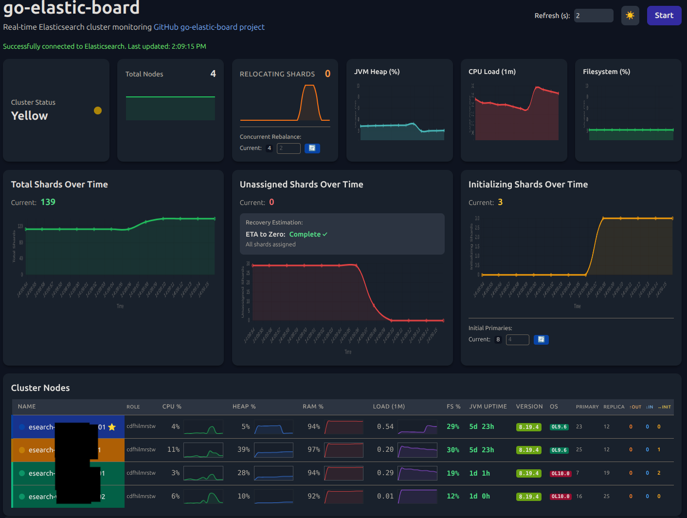

# go-elastic-board



A powerful, real-time Elasticsearch cluster monitoring dashboard written in Go. Features a modern web interface with comprehensive cluster metrics, node monitoring, and cluster settings management.

## Features

### 🔍 **Real-time Cluster Monitoring**

- Live cluster health status with color-coded indicators
- Node statistics with CPU, heap, RAM, and load metrics
- Real-time shard distribution (primary and replica)
- Filesystem usage monitoring with percentage indicators
- Node uptime tracking with color-coded status

### 📊 **Visual Dashboard**

- Interactive charts for CPU, heap, RAM, and load metrics
- Responsive design with automatic table splitting for large screens (2000px+ breakpoint)
- Dark/light theme toggle
- Color-coded node grouping and version differentiation
- Compact table design with optimized column widths

### ⚙️ **Cluster Management**

- View and edit all cluster settings in a comprehensive table
- Quick controls for common settings:
  - Concurrent rebalance allocation
  - Initial primary shard recoveries
  - Rebalance enable/disable dropdown
- Real-time settings updates with validation

### 🔒 **Security Features**

- Optional TLS client certificate authentication
- Configurable allowed CN (Common Name) lists
- CA certificate validation
- Support for both HTTP and HTTPS modes

### 🖥️ **System Information**

- Elasticsearch version display with unique color coding
- Operating system information with shortened names (e.g., "Oracle Linux Server 9.6" → "OL9.6")
- Node roles with optimized display
- Master node indicators (⭐)

### 🎨 **User Experience**

- Configurable refresh intervals
- Automatic connection status monitoring
- Mobile-responsive design
- Embedded static assets (no external dependencies)
- Favicon support

## Installation

### Prerequisites

- Go 1.24.5 or later
- Access to an Elasticsearch cluster

### Build from Source

```bash
git clone https://github.com/xorpaul/go-elastic-board.git
cd go-elastic-board
go build
```

### Quick Start (HTTP Mode)

```bash
# Run without TLS (development mode)
./go-elastic-board -config example.yaml
```

Then open your browser to `http://localhost:8080`

## Configuration

Create a `config.yaml` file based on the provided `example.yaml`:

```yaml
# Server Configuration
server:
  address: "" # Bind to all interfaces (use "127.0.0.1" for localhost only)
  port: "8080" # Port to listen on

# Elasticsearch host
elasticsearch:
  url: "http://localhost:9200"

# TLS Configuration (optional)
tls:
  enabled: false # Set to true to enable client certificate authentication
  ca_file: "/path/to/ca.crt"
  cert_file: "/path/to/server.crt"
  key_file: "/path/to/server.key"
  allowed_cns: # List of allowed certificate Common Names
    - "admin"
    - "monitoring-user"
```

### TLS Client Certificate Authentication

For production environments, enable TLS client certificate authentication:

```yaml
tls:
  enabled: true
  ca_file: "/etc/ssl/certs/ca.crt"
  cert_file: "/etc/ssl/certs/server.crt"
  key_file: "/etc/ssl/private/server.key"
  allowed_cns:
    - "elasticsearch-admin"
    - "monitoring-service"
```

## Usage

### Command Line Options

```bash
./go-elastic-board [options]

Options:
  -config string    Path to YAML configuration file
  -debug           Enable debug logging
  -verbose         Enable verbose logging
  -version         Show version and build information
```

### Connecting to Elasticsearch

1. Start the go-elastic-board server
2. Open your web browser to the configured address (default: http://localhost:8080)
3. Click "Start" to begin monitoring

### Dashboard Features

- **Refresh Interval**: Adjust the data refresh rate (default: 2 seconds)
- **Theme Toggle**: Switch between light and dark modes
- **Responsive Tables**: Tables automatically split on wide screens for better readability
- **Interactive Settings**: Click on cluster settings to modify values in real-time
- **Visual Indicators**: Color-coded health status, versions, and metrics

## Architecture

- **Frontend**: Modern HTML5/CSS3/JavaScript with Chart.js for visualizations
- **Backend**: Go HTTP server with embedded static assets
- **Security**: Optional TLS with client certificate validation
- **Data Source**: Direct Elasticsearch REST API integration
- **Deployment**: Single binary with all assets embedded

## API Endpoints

The application proxies requests to Elasticsearch through these internal endpoints:

- `/_cluster/health` - Cluster health status
- `/_cat/nodes` - Node information with extended fields
- `/_nodes` - Detailed node statistics
- `/_cluster/settings` - Cluster configuration
- `/_cat/shards` - Shard distribution information

## Browser Compatibility

- Chrome/Chromium 90+
- Firefox 88+
- Safari 14+
- Edge 90+

## Dependencies

- Go standard library
- `gopkg.in/yaml.v3` for configuration parsing
- Embedded Chart.js for visualizations
- Embedded Tailwind CSS for styling

## Contributing

1. Fork the repository
2. Create a feature branch
3. Make your changes
4. Add tests if applicable
5. Submit a pull request

## License

This project is open source. Please check the repository for license details.

## Version Information

To check the version and build information:

```bash
./go-elastic-board -version
```

## Troubleshooting

### Common Issues

1. **Connection Issues**: Ensure Elasticsearch is accessible and CORS is properly configured
2. **TLS Certificate Errors**: Verify certificate paths and permissions in the configuration
3. **Permission Denied**: Check that the specified ports are available and the user has binding permissions

### Debug Mode

Enable debug logging for troubleshooting:

```bash
./go-elastic-board -debug -config config.yaml
```

## Screenshots

The dashboard provides a comprehensive view of your Elasticsearch cluster with:

- Real-time metrics and charts
- Cluster health overview
- Node statistics and performance graphs
- Cluster settings management interface
- Responsive design for all screen sizes

---

**go-elastic-board** - Simple, powerful Elasticsearch cluster monitoring made easy.
